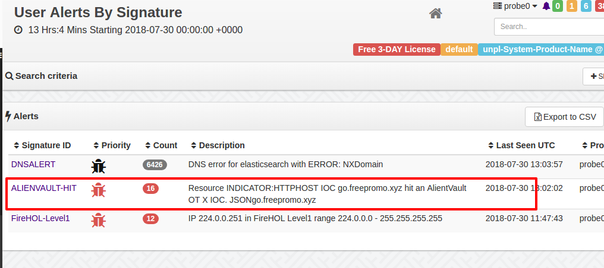

AlienVault OTX Intel Checker
============================

This app checks all artificats in your network traffic against the IOC found in AlientVault OTX.  

The IOCs from OTX are first compiled into a LevelDB database using a helper Ruby script `otx2leveldb.rb`

## The Trisul Intel Framework

Using the [IOC-Harvestor Trisul APP](https://github.com/trisulnsm/apps/tree/master/analyzers/ioc-harvestor) , we can create a new Resource Stream containing all potential IOC candidates in a single place.  The `check_intel.lua` script just checks each of them against a LevelDB database containing IOC information and generates an alert if
there is a hit.

## Getting the AlienVault OTX into a LevelDB database

The first thing you need to do is to get an [AlienVault OTX API Key](https://otx.alienvault.com/). Next on OTX subscribe to any number of **Pulses** which are collections of IOCs from various sources. Then run `installfeed.sh` which pulls in everything into a LevelDB database ready for use by TrisulNSM.


> *Prerequisties*   The installation process needs Ruby and LevelDB installed
> apt install build-essential ruby libleveldb1v5 
> gem install rake faraday leveldb 

````lua
curl -O  https://raw.githubusercontent.com/trisulnsm/apps/master/analyzers/alienvault-otx/installfeed.sh
bash ./installfeed.sh  ALIENVAULT_API_KEY 

````


## Results

Thats it !! When Trisul gets an IOC hit on any of the [14 indicators](https://github.com/trisulnsm/apps/tree/master/analyzers/ioc-harvestor) such as hosts, file hashes, SSL Certs, domains, urls, you will get an alert.
in the User-Alerts group as shown below


 


UPDATES
=======

````
0.0.1   Aug 18 2018     Initial version of APP
````


