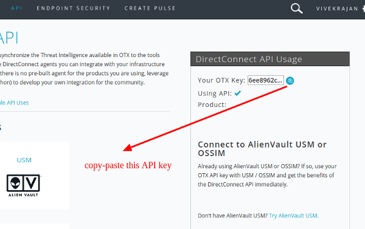

AlienVault OTX Intel Checker
============================

This app checks all artifacts in your network traffic against the threat IOCs found in AlientVault OTX.  

## The Trisul Intel Framework

This APP requires you to first install the [IOC-Harvestor Trisul APP](https://github.com/trisulnsm/apps/tree/master/analyzers/ioc-harvestor) . The IOC-Harvestor APP creates a new Resource Stream containing all potential IOC candidates in a single place.  The `check_intel.lua` script just checks each of them against a LevelDB database.

## Getting the AlienVault OTX into a LevelDB database

First, go on OTX and get an [AlienVault OTX API Key](https://otx.alienvault.com/). Next,  on OTX subscribe to any number of *Pulses* . Pulses are collections of IOCs from various sources.  

### Pre-requisites Ruby and LevelDB 

The feed installation process needs Ruby and LevelDB installed on the Probe. 

#### Ubuntu 
```
apt install build-essential ruby libleveldb1v5 
gem install rake faraday leveldb 
```

#### CentOS/RHEL7
```
yum install https://dl.fedoraproject.org/pub/epel/epel-release-latest-7.noarch.rpm
yum install leveldb
yum install gcc-c++
gem install rake faraday leveldb 
```

## Installing the AlienVault OTX Feed 

Compile the IOCs from OTX into a LevelDB database using the `installfeed.sh` script as shown below.

````lua
curl -O  https://raw.githubusercontent.com/trisulnsm/apps/master/analyzers/alienvault-otx/installfeed.sh
bash ./installfeed.sh  ALIENVAULT_API_KEY 

````

### Where to find the API KEY

Login to your AlienVault OTX account and copy paste the API key. You can find it here




## Viewing the alerts


Congratulations!! When Trisul gets an IOC hit on any of the [14 indicators](https://github.com/trisulnsm/apps/tree/master/analyzers/ioc-harvestor) such as hosts, file hashes, SSL Certs, domains, urls - you will get an alert in the User-Alerts group as shown below. 


 


UPDATES
=======

````
0.0.1   Aug 18 2018     Initial version of APP
````


